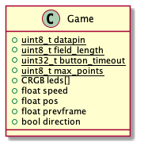
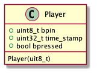

# Jugend Hackt Pong

Ein Projekt des JugendHackt Lab Ulm. Wir entwickeln ein 1D Pong mit Arduino und Ws2812B LEDs.

## Datentypen

Um unser Spiel zu kontrollieren verwenden wir selbsterstellte Datentypen.

### Game

Im Datentyp `Game` speichern wir den Zustand des Spiels.

### Player

Im Datentyp `Player` speichern wir den Zustand des Spielers.

